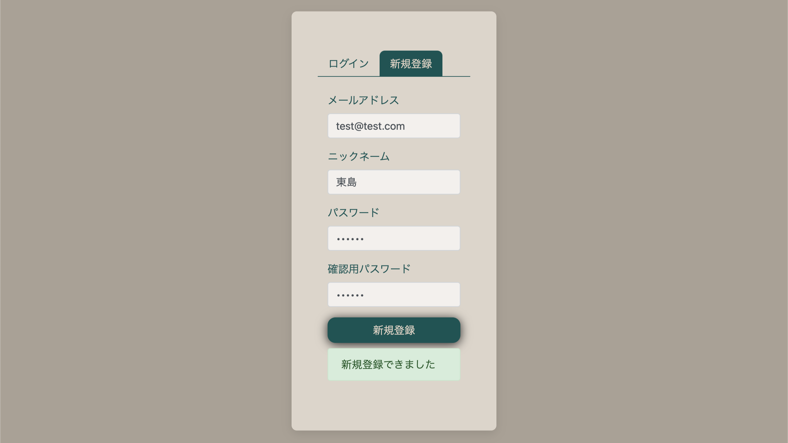
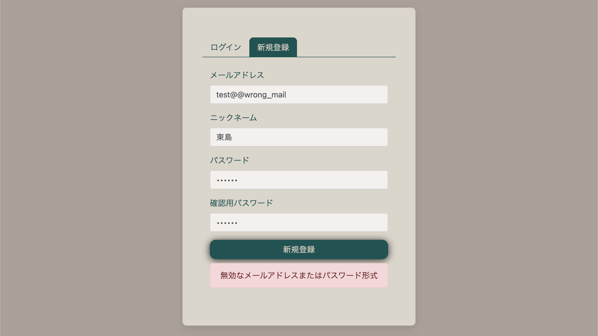
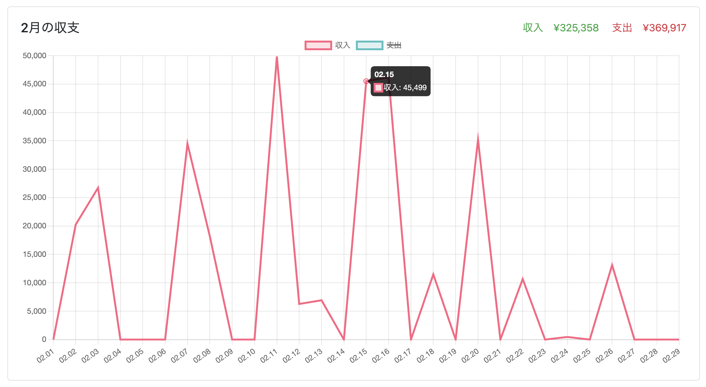
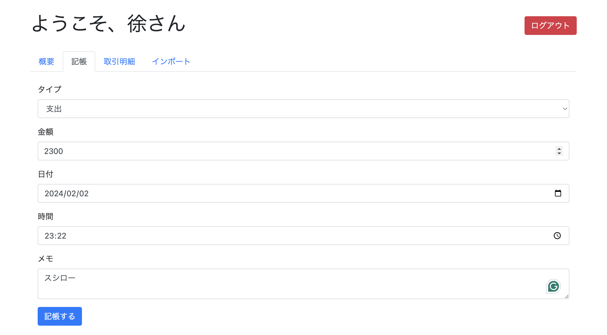
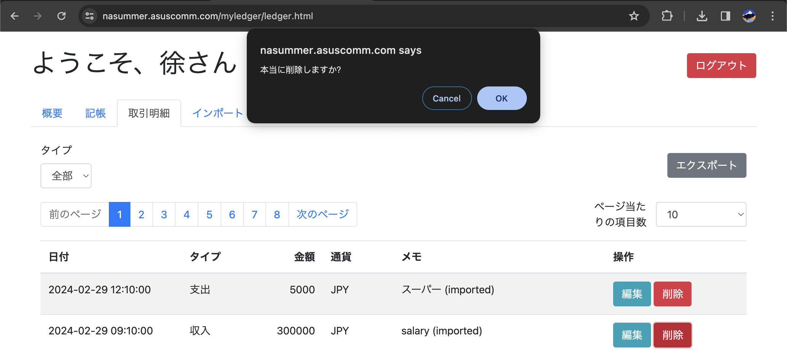
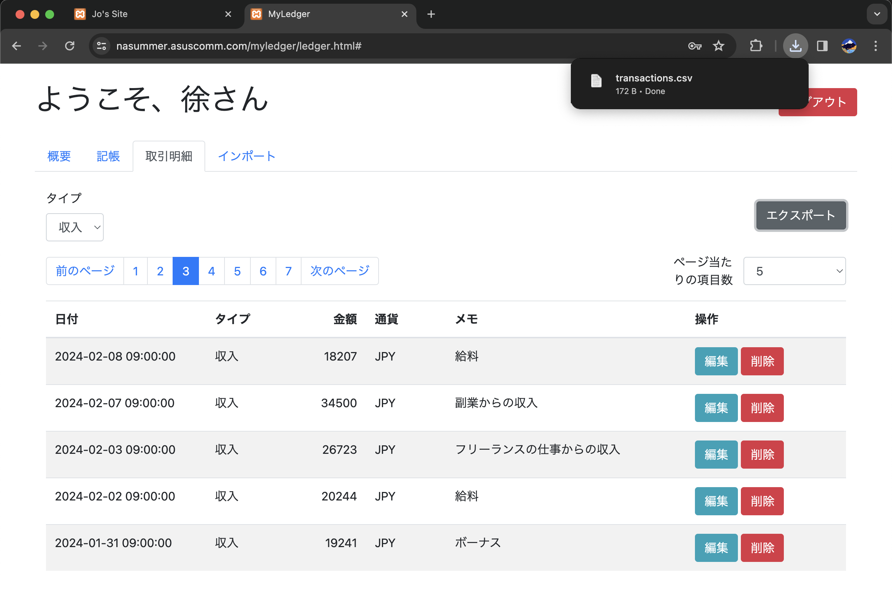
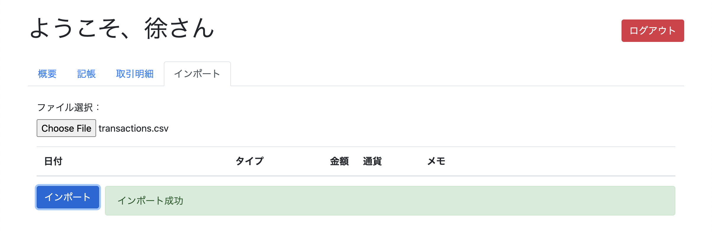

# MyLedger

[日本語](./doc/README_JP.md) | [中文](./doc/README_CN.md)

A simple WEB accounting application based on PHP and MariaDB.

## Getting Started

### Requirements

- **PHP** *8.1.4 - recommanded*
- **MariaDB** *10.4.24 - recommanded*

### Deployment

Clone the project files into the web page folder of your HTTP server.

```shell
git clone https://github.com/NaSummer/MyLedger.git
```

In the database, create a new database user and a database named ledger_db for the application, and properly configure the permissions. (Refer to the root operation part in the [created_db_sample.sql](./created_db_sample.sql) file)

```sql
-- example
CREATE USER 'web'@'localhost' IDENTIFIED BY '123456';
FLUSH PRIVILEGES;
CREATE DATABASE ledger_db;
GRANT ALL PRIVILEGES ON ledger_db.* TO 'web'@'localhost';
```

Create the base tables (Refer to the user operation part in the [created_db_sample.sql](./created_db_sample.sql) file)

```sql
USE ledger_db; -- used in the example

CREATE TABLE users ( -- required
    id INT AUTO_INCREMENT PRIMARY KEY,
    email VARCHAR(255) NOT NULL UNIQUE,
    nickname VARCHAR(255) NOT NULL,
    password VARCHAR(255) NOT NULL
);

CREATE TABLE currencies ( -- required
    id INT AUTO_INCREMENT PRIMARY KEY,
    code VARCHAR(10) NOT NULL
);

CREATE TABLE transactions ( -- required
    id INT AUTO_INCREMENT PRIMARY KEY,
    user_id INT NOT NULL,
    happened_at INT NOT NULL,
    amount DECIMAL(10, 2) NOT NULL,
    currency_id INT NOT NULL DEFAULT 1,
    type VARCHAR(50) NOT NULL,
    description TEXT,
    FOREIGN KEY (user_id) REFERENCES users(id),
    FOREIGN KEY (currency_id) REFERENCES currencies(id)
);
```

Configure the basic data (since a frontend configuration page has not been developed yet), refer to [created_db_sample.sql](./created_db_sample.sql)

```sql
-- required
INSERT INTO currencies (code) VALUES ('JPY');
INSERT INTO currencies (code) VALUES ('CNY');
INSERT INTO currencies (code) VALUES ('USD');
```

Rename the [php/db_sample.php](./php/db_sample.php) file to "**db.php**", and modify the contents of the four variables "**\$db\_host, \$db\_username, \$db\_password, \$db\_schema**" according to the deployment environment.

```php
// example
$db_host = "localhost";
$db_username = "web";
$db_password = "123456";
$db_schema = "ledger_db";
```

Access the website through a browser to check if it runs successfully.

## Instructions

### Registration

Click on the "Sign Up" label on the homepage to enter the registration page.


After filling in the registration information, click the "New Registration" button to register an account. When registration is successful, a success message will be displayed.



If the content filled in is incorrect, such as the wrong email address format, or the passwords entered twice are not the same, an error message will be displayed.



### Login

Upon entering the website, you will be at the login interface. Enter the registered email address and password, then click the "Login" button below to log in.


If the information entered is incorrect, an error message will be displayed.


### Overview Page

After logging in, the overview page will be displayed, showing the current account balance, total income and expenses, a line graph of daily income and expenses for the month, total income and expenses for the week, and total income and expenses for the year, to understand the overall situation easily.


#### Daily Income and Expenses Line Graph

By hovering the cursor over the line graph, you can view the income and expenses data for the selected date, and you can filter the selection of income and expenses.



### Accounting

Accounting can be done on the accounting page.



You can choose the accounting type "Income" or "Expense" through the accounting category.


Clicking on the date option will pop up a date picker, allowing you to conveniently select the date. Similarly, time can also be selected through a similar selector.


After all information is entered, click the "Account" button below to submit the accounting information. Whether the submission is successful or failed, a message will be displayed to the right of the "Account" button, green for success, red for failure, and the reason for failure will be indicated.


### Viewing Details

All accounting details can be viewed on the details page.


You can adjust the number of items displayed per page in the upper right corner of the form.


You can choose the accounting type you want to view through the filter in the upper left corner of the table, such as viewing only income or expenses.


#### Modifying Details

On the details page, you can edit the current selected accounting information by clicking the edit button to the right of the accounting information.


#### Deleting Details

If you want to delete an accounting record, you can click the red delete button to the right of the accounting information. To prevent accidental operations, a confirmation dialog will pop up to confirm deletion. You can confirm to delete or cancel.



### Exporting Data

In the upper right corner of the accounting details page, there is an "Export" button. By using this button, you can export all accounting records under the current filter conditions as a CSV file, making it easier to analyze and process data with more professional software.



CSV Export Data Example

```csv
<!-- example -->
Date,Type,Amount,Currency,Memo
"2023-12-25 09:00:00",Expense,5000.00,JPY,Purchase of groceries at the supermarket
"2023-12-25 09:00:00",Income,33004.00,JPY,Income from gifts
"2023-12-26 09:00:00",Expense,3789.00,JPY,Beauty salon
```

### Importing Data

Data import can be done on the "Import"

 page.


After selecting the import file, the data to be imported will be previewed to the user on the page, at which time the data has not yet been imported.

It is recommended to use the file exported by the "Export" function as a template file, edit the content on this basis, and finally save it as a CSV file for import.

```csv
<!-- example -->
Date,Type,Amount,Currency,Memo
"2023-12-25 09:00:00",Expense,5000.00,JPY,Purchase of groceries at the supermarket
"2023-12-25 09:00:00",Income,33004.00,JPY,Income from gifts
```


After confirming that there are no errors by the user, clicking the "Import" button will proceed with the import. Whether successful or not, a message will be displayed to the right of the "Import" button, green for success, red for failure, and an error message will be displayed.



### Logging Out

By clicking the red "Logout" button in the upper right corner of the page, you can safely log out of the current login status.


## Built With

- Bootstrap 4
- jQuery
- popper.js
- Chart.js

## Authors

- **NaSummer** - *Initial work* - [@NaSummer](https://github.com/NaSummer)

## License

This project is licensed under the MIT License - see the [LICENSE](./LICENSE) file for details.
