# MyLedger

[English](./README.md) | [日本語](./doc/README_JP.md)

一个基于PHP和MariaDB的简易WEB记账应用

## 开始

### 必要组件

- **PHP** *8.1.4 - 推荐*
- **MariaDB** *10.4.24 - 推荐*

### 部署

克隆项目文件到HTTP服务器的网页文件夹中。

```shell
git clone https://github.com/NaSummer/MyLedger.git
```

在数据库中给该应用创建新的数据库用户和名为ledger_db的数据库，并正确配置权限。（参考 [created_db_sample.sql](./created_db_sample.sql) 文件中的root操作部分）

```sql
-- example
CREATE USER 'web'@'localhost' IDENTIFIED BY '123456';
FLUSH PRIVILEGES;
CREATE DATABASE ledger_db;
GRANT ALL PRIVILEGES ON ledger_db.* TO 'web'@'localhost';
```

创建基础表单（参考 [created_db_sample.sql](./created_db_sample.sql) 文件中的user操作部分）

```sql
USE ledger_db; -- used in the example

CREATE TABLE users ( -- required
    id INT AUTO_INCREMENT PRIMARY KEY,
    email VARCHAR(255) NOT NULL UNIQUE,
    nickname VARCHAR(255) NOT NULL,
    password VARCHAR(255) NOT NULL
);

CREATE TABLE currencies ( -- required
    id INT AUTO_INCREMENT PRIMARY KEY,
    code VARCHAR(10) NOT NULL
);

CREATE TABLE transactions ( -- required
    id INT AUTO_INCREMENT PRIMARY KEY,
    user_id INT NOT NULL,
    happened_at INT NOT NULL,
    amount DECIMAL(10, 2) NOT NULL,
    currency_id INT NOT NULL DEFAULT 1,
    type VARCHAR(50) NOT NULL,
    description TEXT,
    FOREIGN KEY (user_id) REFERENCES users(id),
    FOREIGN KEY (currency_id) REFERENCES currencies(id)
);
```

配置基础数据（因为还没有开发通过前端配置的页面），参考 [created_db_sample.sql](./created_db_sample.sql)

```sql
-- required
INSERT INTO currencies (code) VALUES ('JPY');
INSERT INTO currencies (code) VALUES ('CNY');
INSERT INTO currencies (code) VALUES ('USD');
```

修改 [php/db_sample.php](./php/db_sample.php) 文件名为 "**db.php**"，并根据部署环境的情况，修改其中 "**\$db\_host, \$db\_username, \$db\_password, \$db\_schema**" 四个变量的内容。

```php
// example
$db_host = "localhost";
$db_username = "web";
$db_password = "123456";
$db_schema = "ledger_db";
```

通过浏览器访问网站，检查是否运行成功。

## 操作指南

### 注册

在首页点击“新规登录”标签，即可进入注册页面。


填写注册信息后，点击“新规登录”按钮，即可注册账号。当成功注册时，会提示注册成功。

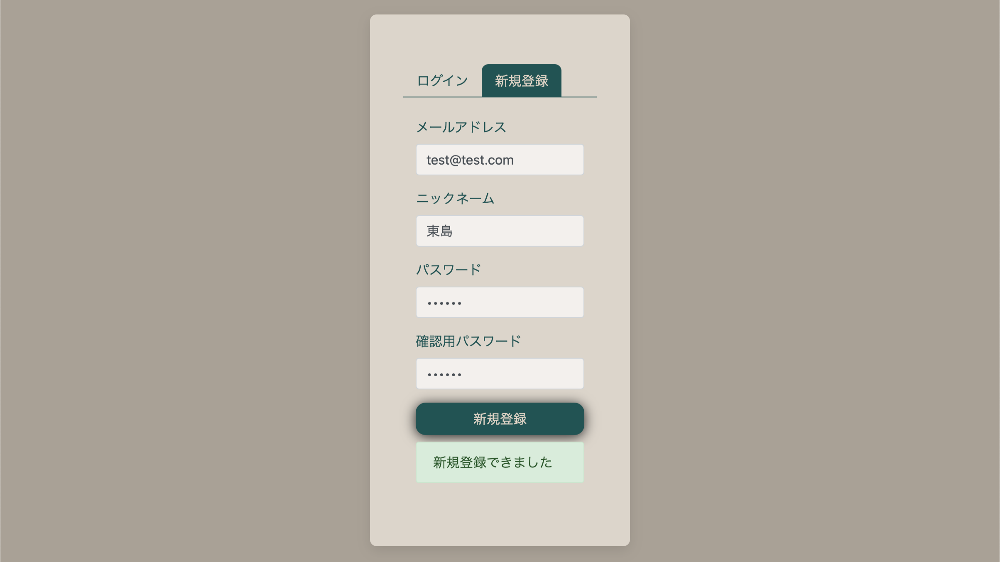

当填写内容错误时，例如错误的电子邮件地址格式，或两次输入的密码不一样，会提示错误信息。

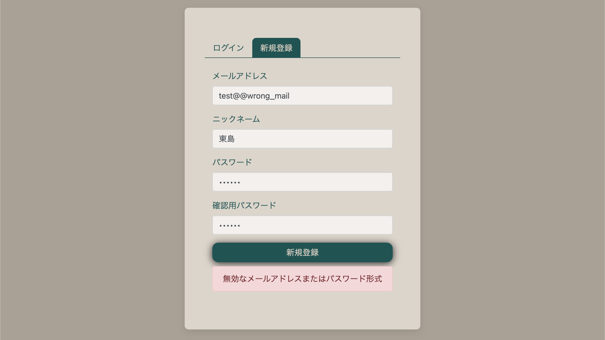

### 登录

在进入网站后，便是登录界面，输入已经注册的邮箱地址和密码，点击下方的“登录”按钮，即可登录。


如果输入的信息有误，将会提示错误信息。

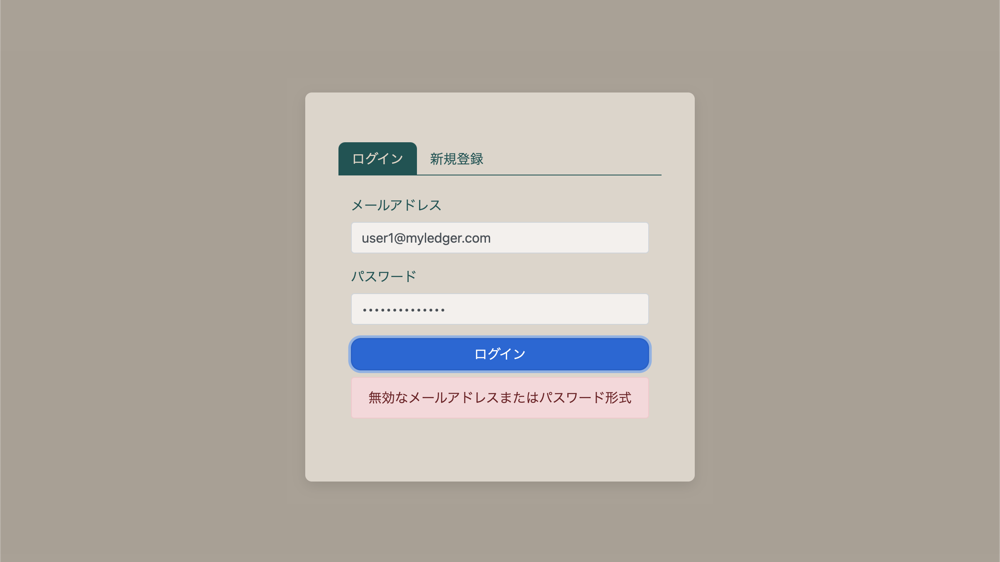

### 概要页面

登录后会显示概要界面，会显现目前账户的余额、总收入支出、本月每日收支折线图、本周总收支、本年总收支的数据，方便了解整体情况。

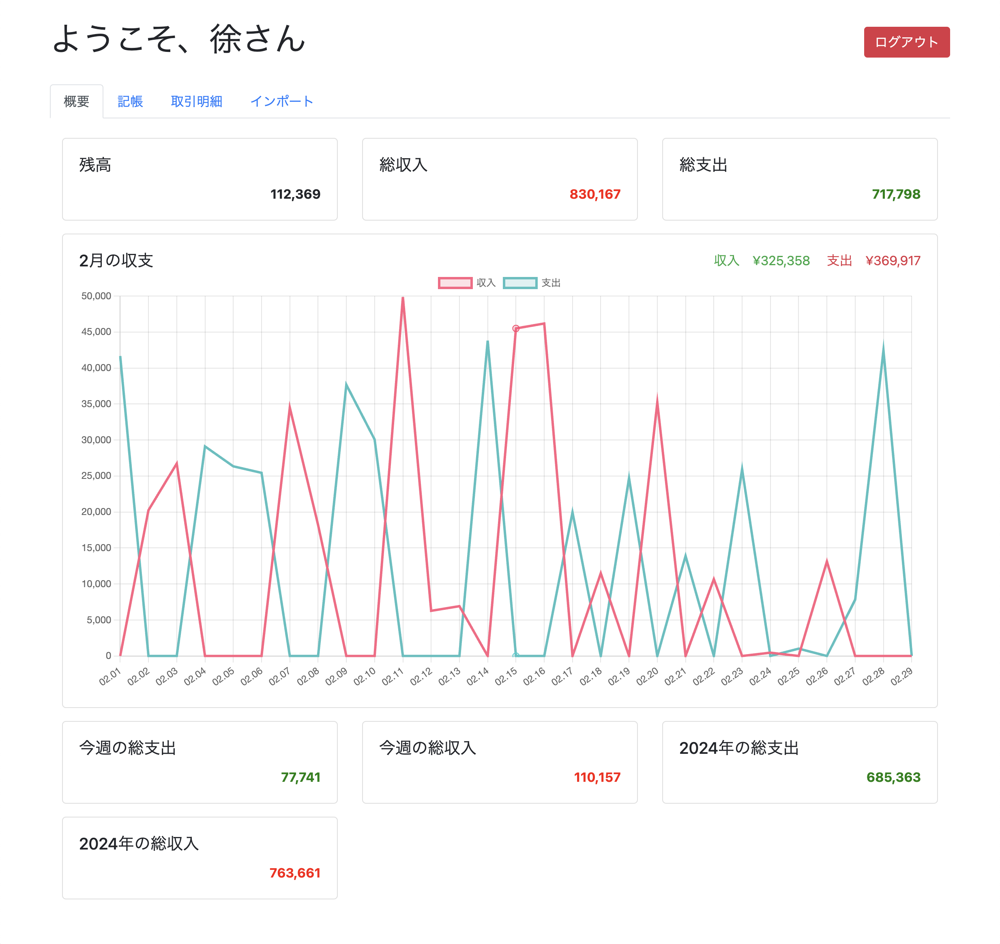

#### 每日收支折线图

讲光标放在折线图上可以查看当前选择日期的收支数据，并且可以筛选收入和支出的选择。

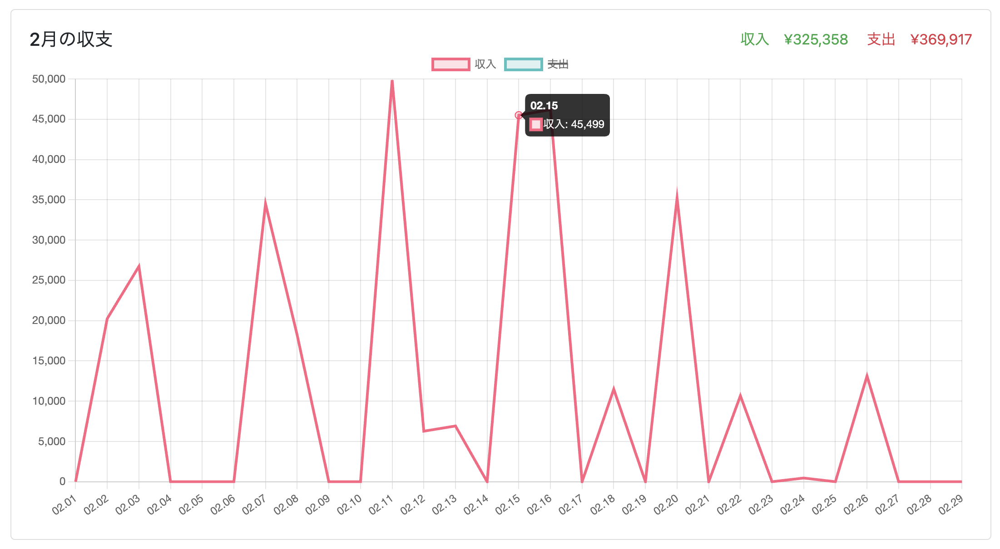

### 记账

在记账页面中可以进行记账

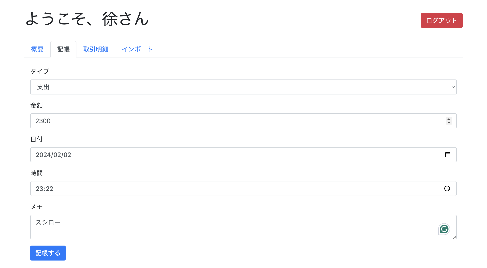

可以通过记账类别选择“收入”或“支出”记账类型。

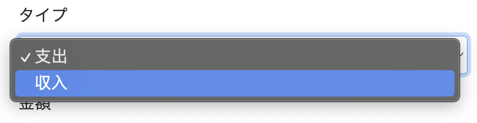

点击日期选项，会弹出日期选择器，可以便捷地选择日期。同理，时间也可以通过类似选择器选择。

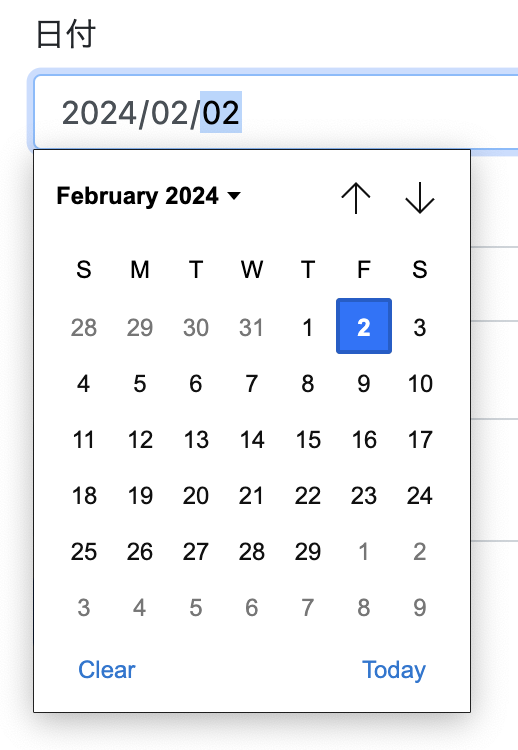

当信息全部输入完毕后，点击下方“记账”按钮，便可提交记账信息。提交成功或失败，都会在“记账”按钮右方提示信息，成功为绿色，失败为红色，并提示失败原因。

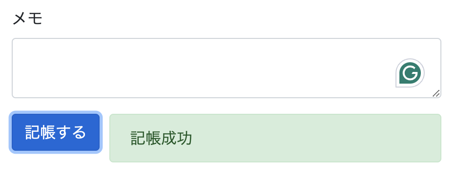

### 查看明细

在明细页面可以查看所有的记账明细


可以在表单右上方调整每页显示的数量

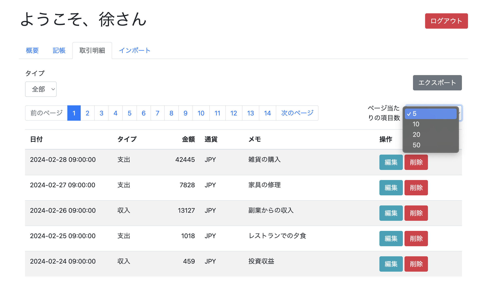

可以通过表格左上方的筛选器选择想查看的记账类型，比如只看收入或支出

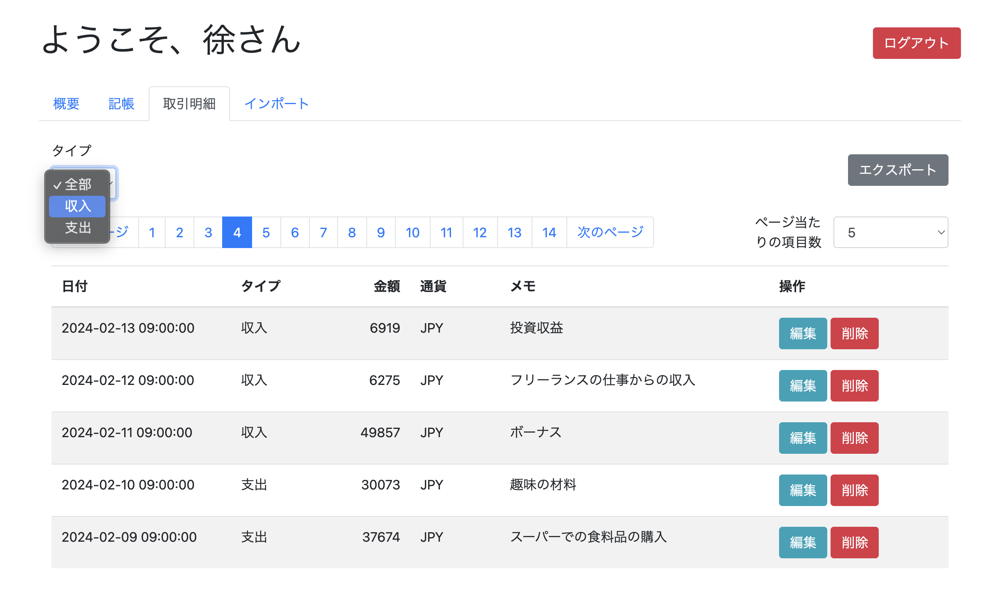

#### 修改明细

在明细页面，点击记账信息右边的编辑按钮，可以编辑当前选择的记账信息

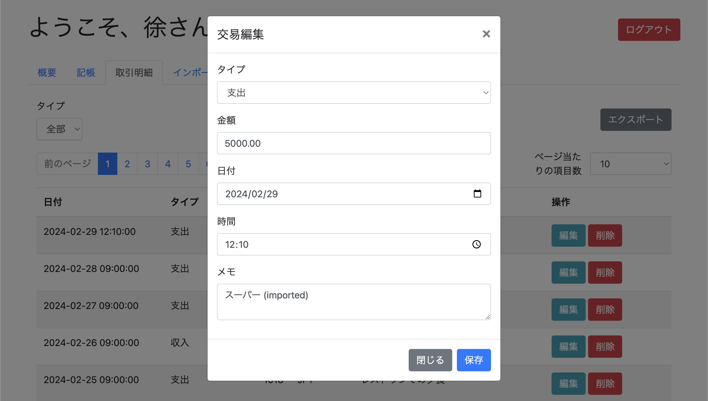

#### 删除明细

想删除一条记账信息时，可以点击记账信息右侧的红色删除按钮，为防止误操作，会弹出提示框确认是否删除，选择确认即可删除，也可以取消。

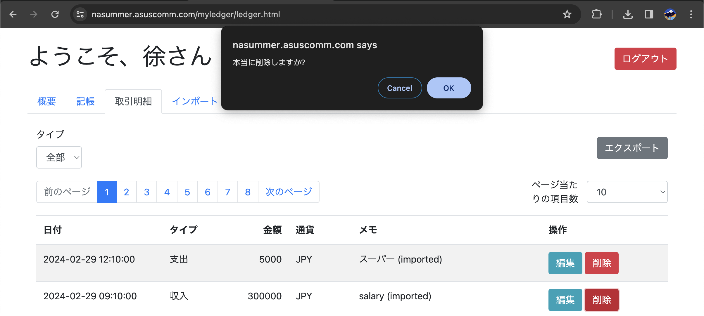

### 导出数据

在记账明细页面的右上方有“导出”按钮，可以通过该按钮导出当前筛选条件下的所有记账记录为csv文件，方便用更专业的软件进行分析和处理数据。

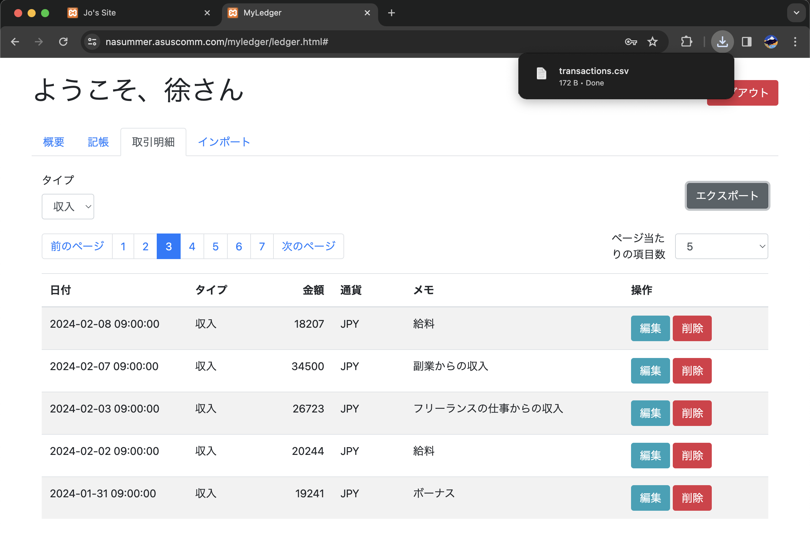

CSV导出数据样例

```csv
<!-- example -->
日付,タイプ,金額,通貨,メモ
"2023-12-25 09:00:00",支出,5000.00,JPY,スーパーでの食料品の購入
"2023-12-25 09:00:00",収入,33004.00,JPY,贈り物からの収入
"2023-12-26 09:00:00",支出,3789.00,JPY,美容院
```

### 导入数据

在“导入”页面，可以进行数据导入。

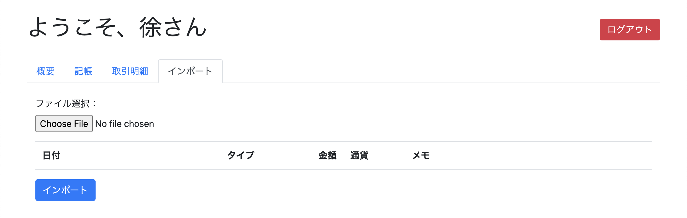

在选择导入文件后，会在页面中向用户预览即将导入的数据，此时数据还没有进行导入。

推荐通过“导出”功能导出的文件作为模板文件，在此基础上进行内容编辑，最后保存为csv文件进行导入。

```csv
<!-- example -->
日付,タイプ,金額,通貨,メモ
"2023-12-25 09:00:00",支出,5000.00,JPY,スーパーでの食料品の購入
"2023-12-25 09:00:00",収入,33004.00,JPY,贈り物からの収入
```

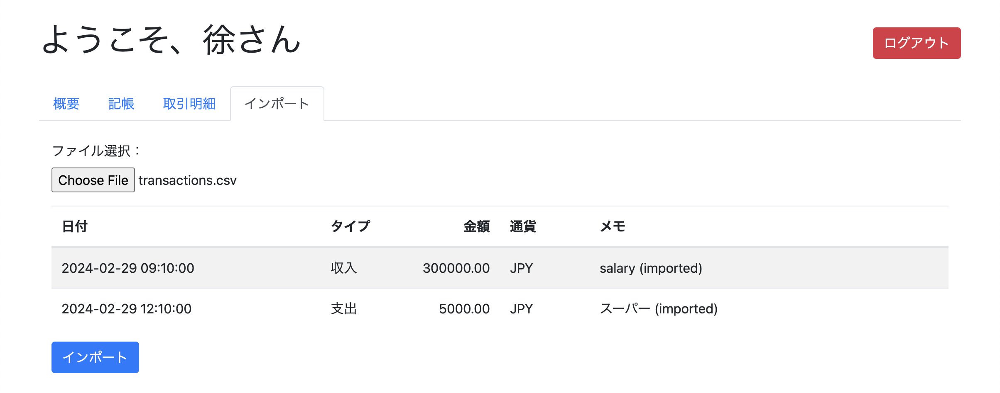

在用户确认无误后，点击“导入”按钮，即可进行导入。成功与否会在“导入”按钮右侧提示，成功为绿色，失败为红色，并显示提示信息。

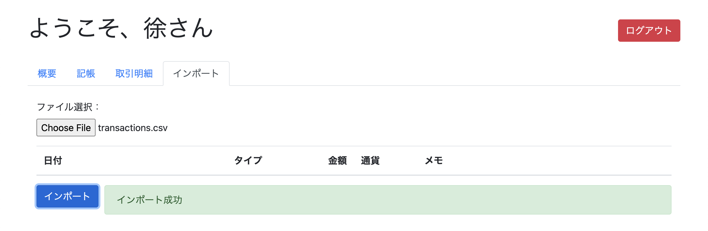

### 退出登录

通过页面右上角的红色“退出登录”按钮，可以安全退出当前的登录状态。


## 技术栈

- Bootstrap 4
- jQuery
- popper.js
- Chart.js

## 作者

- **NaSummer** - *创建者* - [@NaSummer](https://github.com/NaSummer)

## 许可证

该项目根据MIT许可证授权 - 有关详细信息，请参见 [LICENSE](./LICENSE) 文件。
