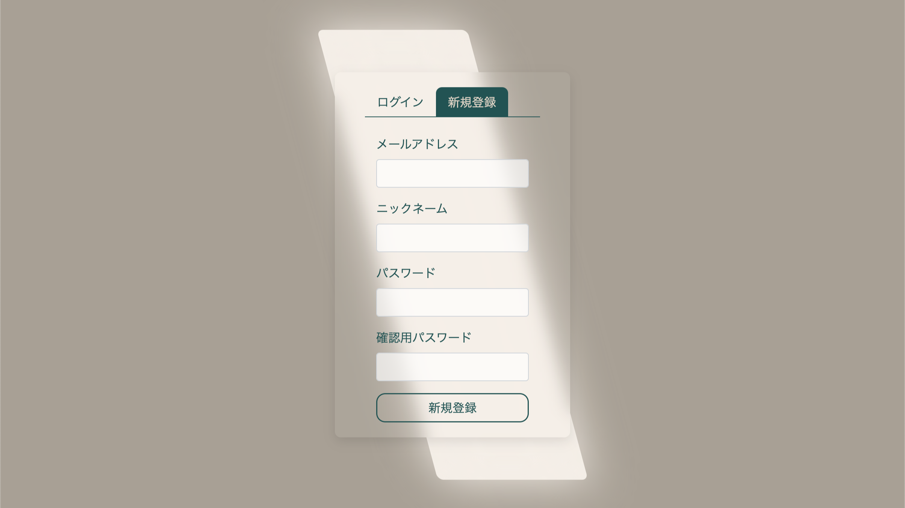
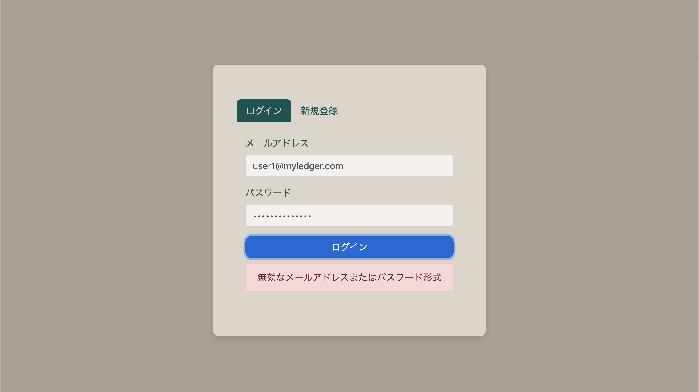
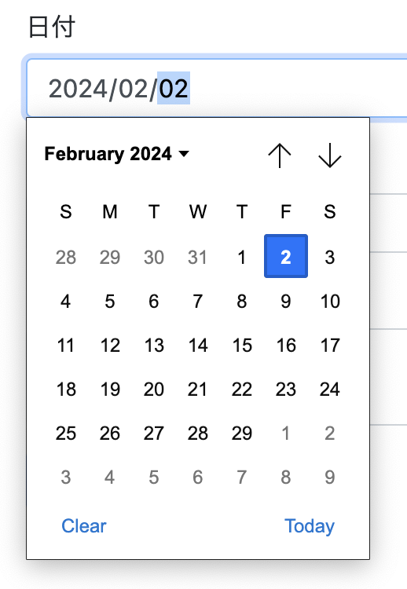
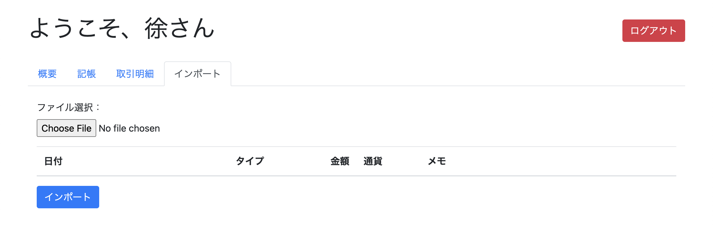

# MyLedger

[English](./README.md) | [日本語](./doc/README_JP.md)

PHPとMariaDBを基にしたシンプルなWEB家計簿アプリ。

## スタートガイド

### 必要条件

- **PHP** *8.1.4 - 推奨*
- **MariaDB** *10.4.24 - 推奨*

### デプロイメント

HTTPサーバーのウェブフォルダー内にプロジェクトファイルをクローンします。

```shell
git clone https://github.com/NaSummer/MyLedger.git
```

アプリ用に新しいデータベースユーザーを作成し、ledger_dbという名前のデータベースを作成して適切な権限を設定します。（[created_db_sample.sql](./created_db_sample.sql) ファイル内のroot操作部分を参照）

```sql
-- 例
CREATE USER 'web'@'localhost' IDENTIFIED BY '123456';
FLUSH PRIVILEGES;
CREATE DATABASE ledger_db;
GRANT ALL PRIVILEGES ON ledger_db.* TO 'web'@'localhost';
```

基本テーブルを作成します（[created_db_sample.sql](./created_db_sample.sql) ファイル内のuser操作部分を参照）

```sql
USE ledger_db; -- 使用例

CREATE TABLE users ( -- 必須
    id INT AUTO_INCREMENT PRIMARY KEY,
    email VARCHAR(255) NOT NULL UNIQUE,
    nickname VARCHAR(255) NOT NULL,
    password VARCHAR(255) NOT NULL
);

CREATE TABLE currencies ( -- 必須
    id INT AUTO_INCREMENT PRIMARY KEY,
    code VARCHAR(10) NOT NULL
);

CREATE TABLE transactions ( -- 必須
    id INT AUTO_INCREMENT PRIMARY KEY,
    user_id INT NOT NULL,
    happened_at INT NOT NULL,
    amount DECIMAL(10, 2) NOT NULL,
    currency_id INT NOT NULL DEFAULT 1,
    type VARCHAR(50) NOT NULL,
    description TEXT,
    FOREIGN KEY (user_id) REFERENCES users(id),
    FOREIGN KEY (currency_id) REFERENCES currencies(id)
);
```

基本データの設定（フロントエンドでの設定ページがまだ開発されていないため）、[created_db_sample.sql](./created_db_sample.sql) を参考にしてください。

```sql
-- 必須
INSERT INTO currencies (code) VALUES ('JPY');
INSERT INTO currencies (code) VALUES ('CNY');
INSERT INTO currencies (code) VALUES ('USD');
```

[php/db_sample.php](./php/db_sample.php) ファイル名を "**db.php**" に変更し、デプロイ環境に応じて "**\$db\_host, \$db\_username, \$db\_password, \$db\_schema**" の4つの変数内容を変更します。

```php
// 例
$db_host = "localhost";
$db_username = "web";
$db_password = "123456";
$db_schema = "ledger_db";
```

ブラウザを通じてウェブサイトにアクセスし、正常に動作するか確認してください。

## インストラクション

### 新規登録

トップページで「新規登録」タブをクリックすると、登録ページに入ります。



登録情報を入力した後、「新規登録」ボタンをクリックすると、アカウントが登録されます。成功した場合は登録成功と提示されます。


入力内容に誤りがある場合、例えばメールアドレスの形式が間違っている、またはパスワードが一致しない場合は、エラーメッセージが表示されます。


### ログイン

サイトに入ると、ログイン画面が表示

されます。登録済みのメールアドレスとパスワードを入力し、「ログイン」ボタンをクリックすると、ログインできます。


入力情報に誤りがある場合、エラーメッセージが表示されます。



### 概要ページ

ログイン後、概要ページが表示され、現在のアカウントの残高、総収入支出、今月の日別収支折れ線グラフ、今週の総収入支出、今年の総収入支出のデータが表示され、全体状況を把握しやすくなっています。


#### 日別収支折れ線グラフ

カーソルを折れ線グラフに合わせると、選択した日付の収支データが表示されます。また、収入と支出の選択をフィルタリングすることができます。


### 記帳

記帳ページで記帳ができます。


記帳カテゴリーから「収入」または「支出」の記帳タイプを選択できます。


日付オプションをクリックすると、日付選択器がポップアップ表示され、簡単に日付を選択できます。同様に、時間も選択器を通じて選択できます。



情報を全て入力した後、下部の「記帳」ボタンをクリックすると、記帳情報を提出できます。提出の成功または失敗は、「記帳」ボタンの右側にメッセージが表示され、成功は緑色、失敗は赤色で、失敗理由も提示されます。


### 明細の閲覧

明細ページで全ての記帳明細を閲覧できます。


表の右上でページごとの表示項目数を調整できます。


表の左上のフィルターを使用して、閲覧したい記帳タイプを選択できます。例えば、収入または支出のみを表示します。


#### 明細の修正

明細ページで、記帳情報の右側にある編集ボタンをクリックすると、選択した記

帳情報を編集できます。


#### 明細の削除

記帳情報を削除したい場合、記帳情報の右側にある赤い削除ボタンをクリックすると、誤操作を防ぐために確認ダイアログが表示され、削除を確認することができます。また、キャンセルも可能です。


### データのエクスポート

記帳明細ページの右上にある「エクスポート」ボタンを使用すると、現在のフィルタ条件下の全ての記帳記録をcsvファイルとしてエクスポートできます。これにより、より専門的なソフトウェアでデータを分析・処理することが容易になります。


CSVエクスポートデータ例

```csv
<!-- 例 -->
日付,タイプ,金額,通貨,メモ
"2023-12-25 09:00:00",支出,5000.00,JPY,スーパーでの食料品の購入
"2023-12-25 09:00:00",収入,33004.00,JPY,贈り物からの収入
"2023-12-26 09:00:00",支出,3789.00,JPY,美容院
```

### データのインポート

「インポート」ページでデータのインポートが行えます。



インポートファイルを選択すると、ページ上でユーザーにインポート予定のデータがプレビューされます。この時点でデータはまだインポートされていません。

「エクスポート」機能でエクスポートされたファイルをテンプレートとして使用し、その上で内容を編集し、最終的にcsvファイルとして保存してインポートすることをお勧めします。

```csv
<!-- 例 -->
日付,タイプ,金額,通貨,メモ
"2023-12-25 09:00:00",支出,5000.00,JPY,スーパーでの食料品の購入
"2023-12-25 09:00:00",収入,33004.00,JPY,贈り物からの収入
```


ユーザーが間違いがないことを確認した後、「インポート」ボタンをクリックすると、インポートが行われます。成功か失敗かは、「インポート」ボタンの右側にメッセージが表示され、成功は緑色、失敗は赤色で、提示メッセージが表示されます。


### ログアウト

ページ右上隅の赤い「ログアウト」ボタンを使用して、現在のログイン状態から安全にログアウトできます。


## 技術スタック

- Bootstrap 4
- jQuery
- popper.js
- Chart.js

## 作成者

- **NaSummer** - *初期作成者* - [@NaSummer](https://github.com/NaSummer)

## ライセンス

このプロジェクトはMITライセンスのもとで公開されています - 詳細については[LICENSE](./LICENSE)ファイルをご覧ください。
